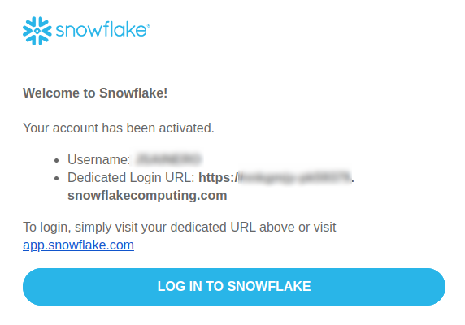
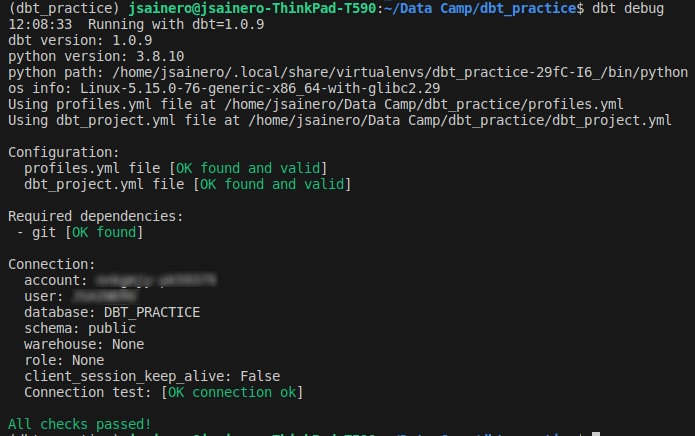

# DBT Practice

## Requisitos/Setup

1. Necesitaremos tener instalado [pyenv](https://github.com/pyenv/pyenv) para gestionar las diferentes versiones de Python, teneís más info en este [link](https://brain2life.hashnode.dev/how-to-install-pyenv-python-version-manager-on-ubuntu-2004#heading-installation).

2. Una vez instalado pyenv debemos instalar la versión de python que vamos a utilizar.

    ```bash 
    pyenv install -v 3.8.10
    pyenv shell 3.8.10
    ```

3. Ahora debemos crear el entorno virtual en el que vamos a trabajar. Para ello utilizaremos [pipenv](https://pipenv.pypa.io/en/latest/installation/) que nos permitirá gestionar entornos virtuales en Python.

    ```bash 
    pip install pipenv
    ```

4. Ahora pasaremos a configurar la base de datos que vamos a utilizar, para ello utilizaremos [Snowflake](https://www.snowflake.com/en/). Debeís registraros en este [link](https://signup.snowflake.com/?utm_cta=trial-en-www-homepage-top-right-nav-ss-evg&_ga=2.90256090.1575067732.1688051356-2104843509.1684226491) y verificar la cuenta.

    

    A través de este enlace nos loggearemos en nuestra cuenta. Es importante recordar tanto el **usuario** y la **contraseña** como el **id de la cuenta** (la parte difuminada de la URL).

5. Cuando estemos dentro de la cuenta, iremos a la pestaña Data>Databases. En la esquina superior derecha habrá un botón para crear una nueva base de datos. Crearemos una base de datos llamada `DBT_PRACTICE` (el comentario lo dejaremos vacío).

6. Ahora ya tenemos configurada la base de datos con la que vamos a trabajar pero debemos conectarnos con ella a través de nuestro proyecto. Para ello crearemos el archivo `.env` en la raiz de nuestro proyecto con el siguiente contenido:

    ```bash
    DBT_PROFILES_DIR=.
    PROFILE_TARGET=snowflake_prod

    SNOWFLAKE_HOST=<id de la cuenta>

    SNOWFLAKE_DATABASE=DBT_PRACTICE
    SNOWFLAKE_USERNAME=<usuario>
    SNOWFLAKE_PASSWORD=<contraseña>
    ```

7. Ya casi estamos llegando al final, nos faltaría descargas las dependencias y activar el entorno virtual. 

    ```bash
    pipenv install
    pipenv shell
    ```

8. Para comprobar si todo ha funcionado correctamente lanzaremos el siguiente comando:

    ```bash
    dbt debug
    ```

    Si todo ha ido correctamente la salida debería ser:

    


## Enunciado

El objetivo de esta práctica es crear un diccionario con todas las posibles rutas que pueden existir en el mundo (muchas de ellas no serán reales, ya porque sean muy largas o porque no son rentables). Una ruta es simplemente una conexión entre dos aeropuertos, por ejemplo la ruta entre Madrid (MAD) y Barcelona (BCN) sería MADBCN.

Se cuenta con un diccionario con la información de todos los aeropuertos del mundo. Este diccionario contiene los siguientes campos:

|Campo|Descripción|
|---------|-------------------|
|STN_CODE|Código de aeropuerto|
|CTRY_CODE|Código del país|
|CTRY_NAME|Nombre del país|
|CITY_CODE|Código de la ciudad|
|GR_AREA_CODE|Código del área grupal|
|GR_AREA_NAME|Nombre del área grupal|
|AREA_CODE|Código del área|
|AREA_NAME|Nombre del área|
|SUBAREA_CODE|Código del subárea|
|SUBAREA_NAME|Nombre del subárea|
|CONTINENT_CODE|Código del continente|
|CONTINENT_NAME|Nombre del continente|
|LATITUDE|Latitud del aeropuerto|
|LONGITUDE|Longitud del aeropuerto|

1. Carga el diccionario en la base de datos [seeds/airports_database.csv](seeds/airports_database.csv)

2. Crea una tabla con todas las posibles rutas. En la carpeta [samples](samples) tenéis una muestra de como debe ser la salida final del modelo.

    Hay varios campos que requieren lógica para construirse:

    |DISTANCE_KM|Lógica|
    |-----------|------|
    ||Es la distancia ortodrómica entre dos puntos, tened en cuenta que la tierra es una esfera y que la información de la que disponéis es la longitud y la latitud de cada aeropuerto. Considerad que la Tierra es una esfera de 6371 km de radio.|

    |MARKET_SEGMENT_CODE|Área|
    |-------------------|----|
    |DO|España|
    |MH|PAISES NO CEE, EUROPA CEE, AFRICA NORTE, ORIENTE MEDIO|
    |LH|AFRICA CENTRO, AFRICA SUR, PACIFICO SUDOCCIDENTAL, EXTREMO ORIENTE, AMERICA CENTRO, AMERICA SUR, AMERICA NORTE|

    |REGIONS_IAG|Área|
    |-----------|----|
    |Spain|ESPAÑA|
    |Europe|PAISES NO CEE, EUROPA CEE|
    |Africa and Middle East|AFRICA NORTE, AFRICA CENTRO, AFRICA SUR, ORIENTE MEDIO|
    |North America|AMERICA NORTE|
    |LACAR|AMERICA CENTRO, AMERICA SUR|
    |Asia and Pacific|PACIFICO SUDOCCIDENTAL, EXTREMO ORIENTE|

    Los campos GR_AREA_NAME, AREA_NAME, SUBAREA_NAME, GR_AREA_CODE, AREA_CODE, SUBAREA_CODE que no tienen sufijo _o (origen) o _d (destino) van a ser los del aeropuerto que esté más arriba en la siguiente jerarquía

    |Orden|Área|
    |-----|----|
    |1|PACIFICO SUDOCCIDENTAL|
    |2|EXTREMO ORIENTE|
    |3|AMERICA SUR|
    |4|AMERICA CENTRO|
    |5|AMERICA NORTE|
    |6|AFRICA SUR|
    |7|AFRICA CENTRO|
    |8|ORIENTE MEDIO|
    |9|PAISES NO CEE|
    |10|AFRICA NORTE|
    |11|EUROPA CEE|
    |12|ESPAÑA|
